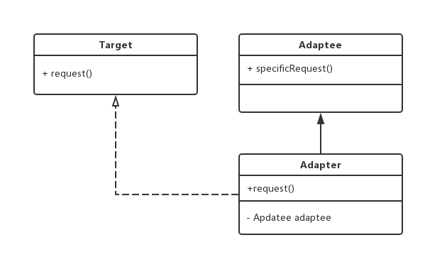
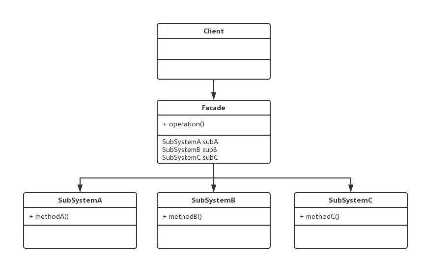

# KotlinDesignPatterns
Kotlin设计模式

简单工厂：
定义一个工厂类，它可以根据参数的不同返回不同类的实例。

[SimpleFactory.kt](/src/com/huangyu/factory/SimpleFactory.kt)

工厂方法：
工厂方法把创建对象的过程抽象为接口，由工厂的子类决定对象的创建。

[FactoryMethod.kt](/src/com/huangyu/factory/FactoryMethod.kt)

抽象工厂：
工厂方法针对一种产品，而抽象工厂是针对一系列产品，为每种产品定义一个工厂方法，工厂子类负责创建该系列的多种产品。

[AbstractFactory.kt](/src/com/huangyu/factory/AbstractFactory.kt)

单例：
单例模式在Kotlin下直接使用object就行了。

[Singleton.kt](/src/com/huangyu/singleton/Singleton.kt)

建造者：
建造者模式是为了构建复杂对象的，一般情况下，Kotlin中使用标准的apply函数就可以。

[Builder.kt](/src/com/huangyu/builder/Builder.kt)

原型：
原型模式是以一个对象为原型，创建出一个新的对象，在Kotlin下很容易实现，用data class的copy就可以。

[Prototype.kt](/src/com/huangyu/prototype/Prototype.kt)

适配器：
适配器模式是把一个不兼容的接口转化为另一个类可以使用的接口。

[Adapter.kt](/src/com/huangyu/adapter/Adapter.kt)

桥接：
桥接模式可以分离某个类存在两个独立变化的纬度，把多层继承结构改为两个独立的继承结构，在两个抽象层中有一个抽象关联。

[Bridge.kt](/src/com/huangyu/bridge/Bridge.kt)

组合：
组合模式是对树形结构的处理，让调用者忽视单个对象和组合结构的差异。

[Composite.kt](/src/com/huangyu/composite/Composite.kt)

装饰：
装饰模式可以给一个对象添加额外的行为，在Kotlin下可以用扩展函数实现。

[Decorator.kt](/src/com/huangyu/decorator/Decorator.kt)

外观：
外观模式是为一个复杂的子系统提供一个简化的统一接口。

[Facade.kt](/src/com/huangyu/facade/Facade.kt)

享元：
享元模式以共享的方式高效地支持大量细粒度对象的重用，享元对象能做到共享的关键是区分了可共享内部状态和不可共享外部状态。

[FlyWeight.kt](/src/com/huangyu/flyweight/FlyWeight.kt)

代理：
代理模式是使用一个代理对象来访问目标对象的行为。

[Proxy.kt](/src/com/huangyu/proxy/Proxy.kt)

